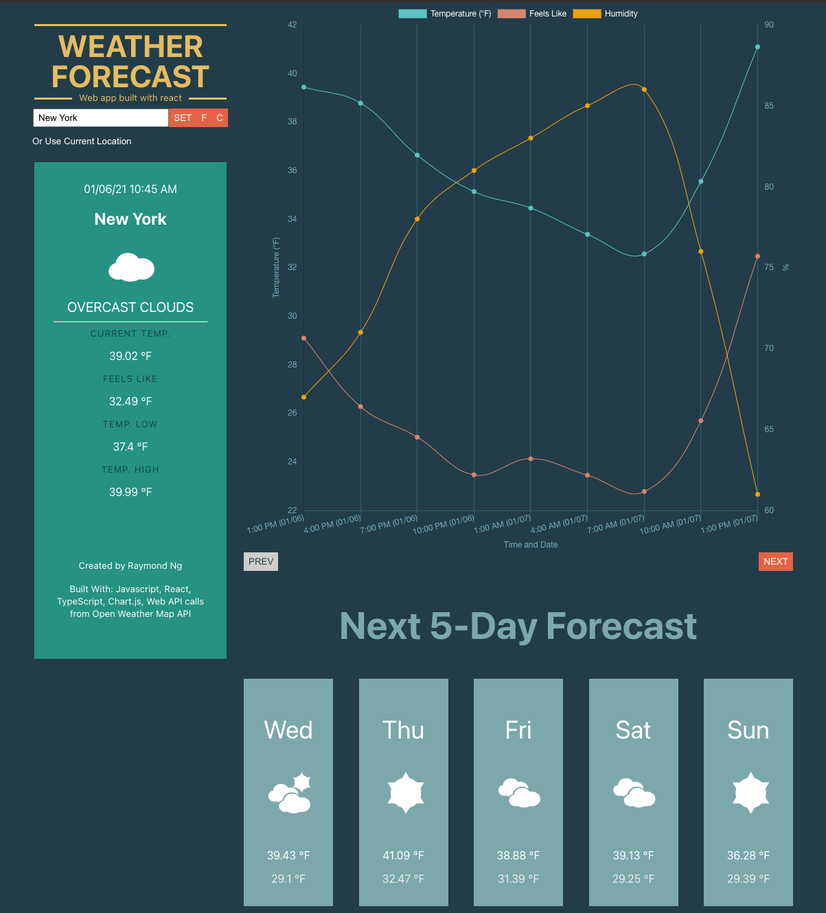

# Weather Forecast App - Built with React, ChartJS, and Powered by OPEN WEATHER MAP API
https://rayng86-weather-forecaster.netlify.app



## Prerequisites
Git clone directory to your local directory
```
git clone git@github.com:rayng86/weather-forecast.git
```

Inside the `env.sample` file, update the environment variable your own Open Weather Map API key.
Also be sure to remove `.sample` at the end of the filename.

## Install Dependencies
```
npm install
```

## Run Locally
In the project directory, you can run:
```
npm start
```